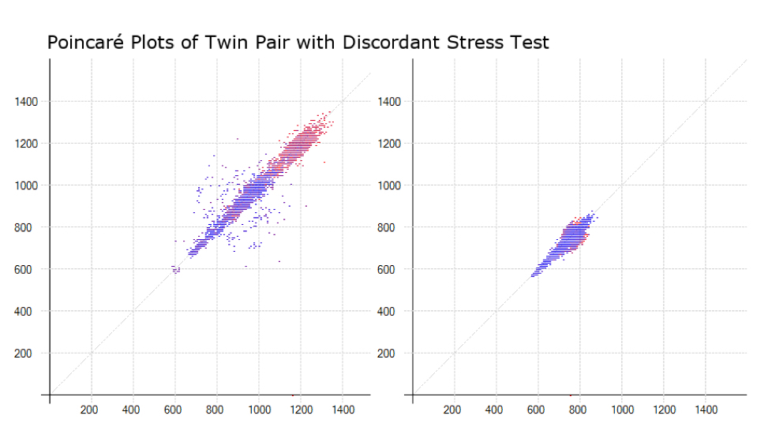

```{r setup, global_options, include=FALSE}
# Knitr layout options
knitr::opts_chunk$set(
  cache = FALSE,
  eval = TRUE,
  echo = FALSE,
  warning = FALSE,
  message = FALSE,
  dpi = 300,
  dev = "png",
  options("scipen" = 0, "digits" = 2)
)
```

```{r flair_color}
library(flair)
darkblue <- "#0C2340"
gold <- "#B58500"
blue <- "#012169"
yellow <- "#F2A900"
teal <- "#487F84"
orange <- "#C35413"
red <- "#DA291C"
violet <- "#6558B1"
magenta <- "#C6007E"
lightblue <- "#008DBA"
black <- "#101820"
grey <- "#B1B3B3"
```

\begin{singlespace}
\tableofcontents
\end{singlespace}

# Acknowledgements

Foremost, I would like to thank my mentors and mentoring team. Dr. Shah has been a tremendous supporter of my academic growth, and has challenged me to continue to explore and learn, and create an area of academic excellence for myself. Dr. Alonso and Dr. Thames have all supported my efforts through direct mentorship and academic guidance. Dr. Quyyumi and Dr. Vaccarino have created a research environment that has laid the groundwork for these projects.

Second, I would like to thank the support staff that has allowed this research to unfold, from the EPICORE group with Nancy Murrah and Lucy Shallenberger, to the MSCR program with Cheryl Sroka and the outstanding MSCR instructors.

Finally, I would like to thank my family for their patience and support.

# Abbreviations

There are several key abbreviations that will be used throughout. They have been outlined here for reference.

<br>

\bfoot

```{r abbreviations}
tribble(
	~Term, ~Abbreviation,
	"HRV", "Heart Rate Variability",
	"CAD", "Coronary Artery Disease",
	"MACE", "Major Adverse Cardiovascular Events",
	"Biobank", "Emory Cardiovascular Biobank",
	"MIMS", "Myocardial Infarction and Mental Stress",
	"MIPS", "Mental Stress Ischemia Prognosis Study",
	"Twins", "Emory Twins Study",
	"PTSD", "Post-Traumatic Stress Disorder",
	"MI", "Myocardial Infarction",
	"MPI", "Myocardial Perfusion Imaging",
	"CFR", "Coronary Flow Reserve",
	"MSIMI", "Mental Stress-Induced Myocardial Ischemia",
	"PSIMI", "Physical Stress-Induced Myocardial Ischemia",
	"ANS", "Autonomic Nervous System"
) %>%
	arrange(Term) %>%
	gt() 
```

\efoot

```{r, include=FALSE}
# Overview
tar_load(diagrams)

# Biobank
tar_load(biobank_tables)

# Twins
tar_load(twins_reports)
tar_load(twins_tables)
tar_load(twins_ecg)
tar_load(twins_clinical)
tar_load(twins_models)

# MIMS/MIPS
tar_load(mims_tables)
tar_load(mims_figures)
tar_load(mims_reports)
tar_load(mims_clinical)
tar_load(mims_models)
```

<!--chapter:end:index.Rmd-->

\mainmatter

# (PART\*) INTRODUCTION {-}

# The Problem

> "Why did he die on Tuesday and not on Monday?"
>
> --- Douglas Zipes

The underlying premise in this question posed by Dr. Zipes is that the cardiac substrate can be *triggered* into an catastrophic maelstrom [@Zipes2006]. 
That trigger is oftentimes psychological in nature, and in the right setting, such as a scarred myocardium, can lead to electrical instability and ventricular arrhythmias [@Lown1979].
The reaction of the body to such stresses is thus a critical step in the pathogenesis of major adverse cardiovascular events.

Patients with psychiatric disease have an increased of cardiovascular disease and overall mortality [@Carney2002; @Boscarino2008].
Depression, for example, is the leading cause of disabilty in the world [@Friedrich2017b], and coronary artery disease (CAD) is the leading cause of death [@McAloon2016b]. 
The prevalence of depression is 20% in patients with CAD, and in those with comorbid depression and CAD, there is a 3-fold increase in cardiovascular mortality [@Jha2019; @Meijer2011].
Thus, understanding how the body reacts to stress can have implications in the the pathogenesis of the increased cardiovascular risk seen in psychological disease.

The purpose of this dissertation is to assess how physiological and psychological stress can be measured, and whether or not these measures of stress are clinically pertinent.
Measuring stress and stress reactivity requires a method to quantify disturbances of the neurocardiac axis, and assessing changes from both a neuropsychological and cardiac perspective [@Davis1993].
Leveraging different types of stress along the neurocardiac axis is important, such as the effect of myocardial ischemia, acute mental stress, chronic psychological stress, and systemic diurnal changes.

# The Approach

The suspected mechanism of behind stress reactivity is through dysfunction of the autonomic nervous system (ANS), particularly as there is an increased mortality with known ANS dysfunction [@LaRovere1998; @Stein2000].
Both psychological stress and myocardial ischemia are known to have a relationship with ANS dysfunction [@Carney2005], and the interaction between sympathetic and parasympathetic nervous activity is thus consequential.

To measure ANS dysfunction, a common surrogate is through electrocardiographic (ECG) changes based on sympathetic and vagal effects upon the sinoatrial node, or pacemaker, of the heart. 
The corresponding heart rate variability (HRV), and its mathematical derivatives, can thus inform us of the dynamic changes to autonomic tone [@Sassi2015].
By measuring autonomic tone during different stress, we can quantify the stress reactivity of the phenomenon and model its impact on clinically relevant factors, such as depression, cardiovascular disease, and major adverse cardiovascular events.

<!--chapter:end:dissertation/01-introduction.Rmd-->

# (PART\*) BACKGROUND {-}

# Clinical Importance

Psychological stress is increasingly recognized as an important potentially modifiable risk factor for cardiovascular disease [@Steptoe2012].
Psychiatric disease leads to an increase cardiovascular disease and overall mortality.
PTSD, for example, has twice the hazard ratio for not only progressive coronary artery disease, but also for overall mortality [@Boscarino2008].
Depression and loneliness have a distinct increase in all-cause mortality [@Steptoe2013a], and almost twice twice the risk of coronary artery disease [@Ford1998].
Specifically, depression is the leading cause of disability worldwide, estimated to be prevalent in over 300 million people, which accounts for roughly 4% of the global population [@Friedrich2017b].
In the United States, the estimated economic burden of depression is $210 billion dollars as of 2010, doubling in cost from 2000 [@Greenberg2015b], suggesting a worsening, growing burden.
CAD on the other hand remains the leading cause of death [@McAloon2016b]. 
This corresponds with approximately $204 billion dollars of estimated direct and indirect costs, with both continuing to climb [@Benjamin2018c]. 

In individuals with CAD, the prevalence of depression is estimated to be 20%, and in those with comorbid depression and CAD, there is over a 3-fold increase in cardiovascular mortality [@Jha2019; @Meijer2011].
This increased risk of mortality in CAD with depression has remained unchanged over the past 35 years [@Carney2017], as only in recent years has depression been considered an additional prognostic marker of mortality in CAD [@Lichtman2014].

Although interventions such as cognitive behavioral therapy and antidepressants are well-proven in reducing symptoms of psychological distress, their impacts are only modest in patients with CAD, and they do not impact event-free survival [@Berkman2003].
Although the American College of Cardiology recommends depression should be routinely screened for in patients with cardiovascular disease, there is limited evidence that this leads to an improvement in overall mortality [@Kronish2019].
More research is needed to understand the therapeutic mechanism underlying psychological distress and CAD [@Carney2017], as there are no effective therapies for these high-risk individuals in comorbid patients.

The causal mechanism is suspected to be through ANS dysfunction, as this has been found to occur in both diseases of the brain and heart [@Davis1993].
Not only are somatic symptoms of psychological stress predictive of cardiovascular mortality, but they may be explained by changes seen in HRV [@Smolderen2017; @Shah2021a].
Similarly, abnormalities in myocardial perfusion are related to and may be predated by abnormalities in HRV [@Shah2020]. 
Thus, investigating the role of autonomic dysfunction in neurocardiac disorders is both mechanistically plausible and may allow for the development of efficacious therapeutic interventions.

# Relevant Literature

The heart itself harbors an intrinsic cardiac nervous system that responds to changes in autonomic tone, such as in myocardial ischemia and infarction, by changing chronotropic, inotropic, and dromotropic responses [@Armour1999; @Zipes1990].
Autonomic dysfunction occurs at multiple levels, from central neurological processes to cardiovascular reflexes [@Abboud2011]. 
This includes vagal withdrawal seen in depression and heigtened sympathetic tone seen in PTSD or cardiovascular disease.
Depression, for example, has been linked to dysregulation of the ANS through changes in levels of catecholamines [@Veith1994b], increased cardiovascular reactivity to stress [@Hughes2008], and decreased baroreflex sensitivity [@Davydov2007].

ANS-related mechanisms are important as they may inform future therapies. 
In the past, stellectomy was found to reduce angina pectoris and ventricular dysrhythmias [@Schwartz2017a].
Modern interventions have shown to improve symptom burden in both depression and CAD [@Penninx2017].
Vagal nerve stimulation has been shown to relieve cardiac arrhythmias, and has been effective against treatment-resistant depression [@Zhang2011a].
In PTSD, non-invasive vagal nerve stimulation has also been found to blunt the sympathetic response to stress [@Gurel2019a].

HRV has been shown to be an effective ECG-based biomarker for ANS dysfunction. 
HRV is an accepted measure of autonomic activity, as it is an integration of sympathetic and parasympathetic efferent input at the level of the sinoatrial node [@Saul1990].
For example, the non-linear HRV marker of *Dyx* has been shown to predict ventricular dysrhythmia and cardiovascular mortality after myocardial infarction, with a hazard ratio of 2.4 (95% CI 1.5 --- 3.8) [@Jørgensen2016]. 
In addition, individuals with chest pain and abnormal *Dyx* had an odds ratio of 8 (95% CI 3.1 --- 23.99) for abnormal exercise stress test [@Goldkorn2015b].
Not only does HRV correlate well with cardiovascular disease, but is strongly correlated with depression [@Stein2000]. 
This relationship between psychological stress, cardiovascular disease, and the autonomic nervous system is thus an appropriate candidate for further investigation, particularly in justifying the clinical utility in measuing autonomic dysfunction [@Carney2005].
In addition to chronic mental stress, acute mental stress has become a more common way of assessing physiological reactivity. 
Mental stress has been shown to associate with chronic psychological stressors [@Petrowski2016], and can also lead to the development of myocardial ischemia [@Arri2016]. 
This phenomenon, known as mental stress-induced myocardial ischemia (MSIMI), is an important reaction to stress that has been shown to predict long-term clinical outcomes [@Vaccarino2018].
HRV has been shown that to associate with acute mental stress [@Castaldo2015], but the relationship between MSIMI has not yet been determined.

The circadian rhythm in autonomic dysfunction is also relevant. The response to the stress of changing from sleep to wake has been seen to associate with increased cardiovascular mortality.
There is an increased frequency of sudden cardiac death based on time of day, usually peaking between 6 AM and 10 AM [@Muller1999; @Boudreau2011], with a secondary peak between 6 PM and 8 PM [@Mulcahy1988]. 
There is a circadian pattern to autonomic outflow, melatonin, cortisol, and circulating catecholamines which could increase vulnerability to ischemia and cardiac death during morning hours [@Boudreau2011; Scheer2010].
The relationship of circadian changes in HRV and myocardial perfusion has been shown to be related [@Shah2020], but how circadian changes may be important in psychological stress and overall mortality is not yet known.

<!--chapter:end:dissertation/02-background.Rmd-->

# (PART\*) METHODS {-}

# Specific Aims {#aims}

The response to both physiological and psychological stress can be markers of overall cardiovascular adaptability. The following aims help to assess the clinical importance of stress reactivity as measured by disturbances to the neurocardiac axis. 

1. To assess the association between myocardial ischemia and coronary perfusion on cardiac autonomic activity. 
1. To determine if cardiac autonomic activity modifies the relationship between acute and chronic psychological stress and myocardial ischemia.
1. To explore the association of cardiac autonomic activity with future major adverse cardiovascular events.

To achieve these aims, we will leverage the several data sets, including the Emory Cardiovascular Biobank (*Biobank*), the Myocardial Infarction and Mental Stress (*MIMS*) and Mental Stress Ischemia Prognosis Study (*MIPS*), and the Emory Twins Study (*Twins*). Each of these data sets contribute variations of coronary artery physiology, acute and chronic mental stressors, and electrocardiographic data of varying recording lengths.

# Study Design

## Population Characteristics and Study Overview

### Emory Cardiovascular Biobank

The *Biobank* studies major cardiovascular events, and also evaluates additional biomarkers for inflammation, cardiac injury, and genetics, with the goal of predicting CVD outcomes [@Ko2017].
All patients aged 18 years and older undergoing cardiac catherization were included. 
During the index cardiac catheterization, additional measures including lifestyle factors, psychological status, medical comorbidities, revascularization and previous procedures were ascertained via patient interview and chart review. 
Additionally, ambulatory ECG was collected with the VivaLNK patch, which was placed on the morning of cardiac catheterization and removed after catheterization for up to 24 h of data recording.
Patients were excluded if they have congenital heart disease, severe valvular heart disease, severe anemia, a recent blood transfusion, myocarditis, history of active inflammatory disease, cancer or are unable or not willing to provide consent (approximately 5%). 
Those that are found to have atrial fibrillation or have >20% ectopic beat burden or noise, as well as those that are pacer dependent were excluded.
Those with known CAD were also excluded.

### Emory Twins Study

The *Twins* is a cross-sectional study was designed to evaluate the relationship of abnormal stress myocardial perfusion with autonomic function, measured hourly over the course of 24 h, in individuals without known ischemic heart disease. 
Subjects were drawn from the Emory Twin Study, which recruited middle-aged male twin pairs from the Vietnam Era Twin Registry [@Shah2013; @Vaccarino2009a; @Goldberg2002].
Pairs of twins were examined at the Emory University General Clinical Research Center, and all data collection occurred during a 24-hour admission under controlled conditions. 
The twins in each pair maintained a nearly identical schedule, with all data collection beginning and ending at the same time. 
The twins arrived at 11 AM, with ECG recording started at approximately 1 PM, questionnaires and exam performed between 2 and 4 PM, dinner at 5 PM, bedtime at 10 PM, wake-up time at 6:30 AM, and PET scans performed between 8 and 10 AM the following morning. 
The twins were followed longitudinally for follow-up events, including review of national registries, which were adjudicated.
Subjects were excluded from analysis if they were unable to complete pharmacological stress testing. 

### Mental Stress Ischemia Mechanisms and Prognosis, Myocardial Infarction and Mental Stress

The study design has been described prior, and is the same between the two cohorts [@Hammadah2017a].
The *MIMS* cohorts had recent myocardial ischemia within the 8 months prior to enrollment and were younger than 61 years of age at time of screening. 
The *MIPS* cohort included patients with stable CAD diagnosed via coronary angiogram, documented MI, or positive nuclear stress test. 
All patients underwent mental stress test and physical stress test using either treadmill or regadenosine, and were randomly assigned to complete one and then the other in two separate visits within a week.
During the initial visit, medical history and psychological assessments were performed as well.
During the mental stress testing, all patients had ECG recordings made of variable duration.
Patients were followed longitudinally for 3-5 years for follow-up events, which were adjudicated.
Patients were excluded for having acute coronary syndrome or decompensated heart failure, severe psychiatric conditions other than depression, pregnancy, uncontrolled high blood pressure, or contraindications to pharmacological stress testing. 

## Measurements

### Electrocardiography Measures

In all three cohorts, ECG data was collected and analyzed using similar techniques. As described, in the *Biobank*, ECG was collected through a single, bipolar lead using the VivaLNK patch, with data being recorded for up to 24 h. In the *Twins*, ambulatory ECG was collected through Holter monitor (GE Marquette SEER digital system; GE Medical Systems, Waukesha, Wisconsin) for 24 h. Holter monitor was also used in the *MIMS/MIPS*, however the recording time was only for several hours.

Variations in heart rate can be assessed by a number of mathematical measures, usually divided into the time and frequency domains [@TaskForceoftheESCandNAS1996a].
HRV was calculated through the Physionet Cardiovascular Signal Toolbox [@Vest2018], which is an open-source MATLAB software for analyzing ECG signal.
Time domain measures we used include the RR interval duration (converted to heart rate in beats-per-minute), the standard deviation of normally conducted RR intervals (SDNN), the root mean square of successive differences in normally conducted RR intervals (RMSSD), and the proportion of normally conducted RR intervals that differ by more than 50 ms divided by the total number of normally conducted RR intervals (PNN50). 
Frequency-domain measures computed through power spectral analysis categorize variability as very low frequency (VLF, 0.0033 to <0.04 Hz), low frequency (LF, 0.04 to <0.15 Hz) or high frequency (HF, 0.15 to 0.40 Hz) [@Akselrod1981].
These frequency categories reflect autonomically mediated heart rate responses to physiologic stimuli, including influences of the renin-angiotensin-aldosterone system, baroreceptor activity, and respiration [@Akselrod1981].
The sympathetic and parasympathetic nervous systems influence them to different degrees. 
HF reflects primarily parasympathetic nervous system activity, while LF reflects both sympathetic and parasympathetic activity [@ReyesdelPaso2013].
Total power HRV is a nonspecific global measure. 
RMSSD is an approximate correlate of HF, and SDNN is an approximate correlate of TP, supporting the physiological basis of these markers.[Electrophysiology1996b]
Acceleration capacity and deceleration capacity were also included where available, based on signal quality and recording length, as they also reflect clinically relevant sympathetic and vagal activity [@Bauer2006c].
These metrics are well-known as physiologic markers of acute and chronic stress, and measure slightly different aspects of autonomic nervous system function.
HRV was also analyzed hourly through the commercial HeartTrends algorithm (Lev-El Diagnostics Ltd, Israel), which generated the *Dyx* measure.
*Dyx* is derived from heart rate time series analysis and measures the variability and randomness of the heart rhythm. 
*Dyx* is generated through the multipole method analysis of Poincaré plot, in which beat-to-beat (RR) interval lengths are plotted as a function of prior RR intervals to form an ellipse, as seen in Figure \@ref(FigurePoincare).
*Dyx* is calculated as the ratio of the kurtosis along the y-axis (long-term variability) and the x-axis (beat-to-beat random variation) of the ellipse, and higher values indicate more beat-to-beat randomness and/or decreased variability [@Olesen2005; @Lewkowicz2002].

In addition to summary and hourly assessments of HRV, diurnal rhythms were examined using cosinor metrics within the *Twins* [@Refinetti2007]. Morphological assessment of ECG changes were also performed in the *MIMS/MIPS* with T-wave area.

### Psychological Measures

In all cohorts, chronic psychological variables were measured through patient interviews. 
In the *Biobank*, depressive symptoms were assessed via the 9-question Primary Care Evaluation of Mental Disorders Brief Patient Health Questionnaire (PHQ-9) [@Kroenke2001].
Moderate-severe depression is considered when the PHQ-9 score is 10 points or higher (out of 27), with this cutpoint having a sensitivity and specificity of 88% for major depression. 
Within the *Twins* and *MIMS/MIPS* cohorts, depressive symptomers were assessed with Beck's Depression Inventory, which includes 21 items with 4 statements scored 0-3, with higher scores indicating higher severity of depression [@Beck1988].
A cut-off of $\geq$ 14 points was used to identify patients with moderate-to-severe depressive symptom burden.
The diagnosis of post-traumatic stress disorder (PTSD) was defined using the Structured Clinical Interview for Diagnostic and Statistical Manual of Mental Disorders, 4th Edition (DSM-IV) [@First2004].

In the *MIMS/MIPS* cohort, there was a separate protocol for acute mental stress challenge. 
Patients were initially allowed to rest for 30 minutes in a calm, quiet, dimly lit, and temperature-regulated room.
After the resting period, mental stress was induced by a standardized public speaking task, as previously described [@DavidGoldberg1996].
The patients were asked to imagine a real-life stressful situation, such as a close relative having been mistreated in a nursing home, and then asked to make up a realistic story around this scenario.
They were given two minutes to prepare the statement, and three minutes to present it in front of a video camera and an audience.
The patients were told that the speech would be evaluated for content, quality, and duration.

### Cardiac Measures

All cohorts underwent imaging of the heart through different modalities, which all assess complementary aspects of myocardial blood flow. 

The *Biobank* used direct coronary angiography through cardiac catheterization.
Obstructive CAD was defined as $\ge$ 70% stenosis or hemodynamic significance by fractional flow reserve. 
Coronary angiography was used to determine the Gensini score, which is a visual estimation of luminal narrowing in multiple segments based on a modified form of the American Heart Association classification of the coronary tree by trained cardiologists [@Gensini1983].
Coronary angiography was also evaluated using the Coronary Artery Surgery Study (CASS), which evaluates the number of major epicardial vessels that have a certain percent stenosis, e.g. the CASS-50 score determines the number of vessels with $\ge$ 50% stenosis [@Ringqvist1983].
Importantly, direct coronary angiography is limited to visualization of the large, epicardial conduit vessels.

The *Twins* study used MPI using underwent MPI using nitrogen-13-ammonia positron emission tomography (PET) with adenosine as the pharmacologic stressor.
Adenosine doses were calculated to induce maximal coronary vasodilation [@Vaccarino2011]. 
Areas of diminished uptake indicate reduced capacity to maximally vasodilate, thereby causing relative coronary hypoperfusion. 
Images were visually interpreted by experienced cardiologists and radiologists with training in nuclear cardiology. 
Quantitative analysis was performed with the Emory Cardiac Toolbox to generate: a) coronary flow reserve (CFR) for absolute myocardial blood flow during stress and rest, and b) the stress total severity score (STSS), which measures the sum of the number of standard deviations below the expected value for each pixel compared to a database of normal controls [@Hutchins1990]. 
CFR was defined as the ratio of mean stress to rest myocardial blood flow (mL/min/g), and low CFR was defined as a ratio $<$ 1.5 [@Gould2018a].
Abnormal MPI findings were defined as $>$ 5% MPI deficit.
For generalizability, semi-quantitative assessments were used. 

In the *MIMS/MIPS*, MPI was also used but with single-photon emission computered tomography (SPECT), using sestamibi radio-labelled with Technetium-99. 
SPECT was performed at rest, after mental stress, and after physical stress (either exercise or pharmacological). 
Myocardial perfusion abnormalities were quantified using the Emory Cardiac Toolbox software, similar to the *Twins*, and semi-quantitative assessments were determined.

## Sample Size and Power Considerations

The subjects for the *Biobank* were enrolled from September 2019 to February 2020, however further enrollment was limited due to the COVID-19 pandemic. 
It was expected that approximately 200 patients would be needed for adequate power, but due to limitations, the analyses were conducted on available data.
The enrollment for *MIMS/MIPS* and *Twins* was completed prior to the initiation of this analysis, and provided a robust population to expand upon and answer the specific aims.

# Analysis

Statistical analysis was performed using R 4.0.0 (R Core Team 2020, Vienna, Austria). 
The analytical approach was guided by the specific aims (Section \@ref(aims)). 

## Clinical Characteristics

In the *Biobank*, HRV was summarized over the recording length and at 15-30 minute intervals at the time of coronary angiography. 
In the *Twins*, HRV was computed hourly, including *Dyx*. 
The 24-hour data was used to generate cosinor statistics as well using published software [@Shah2020d]. 
In the *MIMS/MIPS*, HRV was computed for each phase of the mental stress challenge. 
Power spectral density measures of HF, LF, and VLF HRV were log-transformed for normal distribution.
Each of the clinical cohorts was described by clinical covariates, including frequency of comorbid diseases and summary statistics of continuous measures.

## Myocardial Ischemia

The purpose of **Aim I** was to identify the relationship of autonomic dysfunction with CAD, as measured by both coronary angiography and MPI. 
Within the *Biobank*, summary HRV metrics were compared between those with obstructive CAD versus nonobstructive CAD using the Wilcoxon rank sum test. 
HRV was then assess in a similar manner between those receiving revascularization and those that did not. 
HRV was segmented by timing of coronary angiography. 
HRV was compared at the start of catheterization (or initial intervention in those that were revascularized) to the 30 minutes before the procedure, by intervention status. 

To evaluate the relationship with myocardial perfusion, HRV was also assessed within the *MIMS/MIPS* cohort, which had both mental and physical stress MPI as outcomes. 
Logistic regressions were used with HRV during stress and rest as the exposures, not adjusted for clinical covariates. 
The area under the receiver-operator characteristic curves were generated. 

```{r}
fit <- 
	twins_models$equipment$lin_lf_adjusted %>%
	filter(outcomes == "global_cfr" & level == 7 & test_num == 10) %>%
	pull(fit) %>%
	.[[1]] %>%
	pluck("fit")

extract_eq(fit, wrap = TRUE, terms_per_line = 4)
```

Within the *Twins*, similar analyses were performed with MPI and hourly HRV. Early morning, approximately 7 AM, HRV was used based on previous work suggesting the strong temporal relationship of HRV with clinical outcomes [@Shah2020]. 
Generalized linear mixed-effects models with Laplace approximations were used to account for clustering within twin pairs and within repeat study visits [@Carlin2005a].
Coronary flow reserve was treated as the outcome variable in linear models, and abnormal MPI was treated as the outcome variable in logistic models. 
With the mixed-effects model, with random effects or conditioning for both twin pair status and repeat study visits. 
The models were sequentially adjusted for demographic variables (age, BMI, and race), and then for cardiovascular risk factors (smoking, hypertension, cardiovascular disease).
HRV was summarized as cosinor metrics of MESOR (midline estimating statistic of rhythm), amplitude, and acrophase. 
These metrics were treated as exposures, with CFR and MPI as outcomes, in mixed effects models as above.

## Psychological Stress

The purpose of **Aim II** was to establish the relationship between psychological stress and autonomic dysfunction.
Acute psychological stress was defined as the mental stress challenge in the *MIMS/MIPS* cohorts. Chronic psychological stress was defined as diagnoses of depression and PTSD, and/or symptom burden.

In the *Biobank*, the distribution of HRV was compared between those with depression, as measured by PHQ-9, using Wilcoxon rank sum test. 
In the *Twins*, using the above described generalized linear mixed-effects models, regression analysis was performed with early morning HRV as the exposure and either PTSD or depression as the outcome. 
Sequential adjustment was performed for demographic factors and cardiovascular risk factors. 
Cosinor metrics were also used as additional exposure variables in additional mixed-models.

The *MIMS/MIPS* cohort offered the opportunity to assess both acute and chronic psychological stress. 
The distribution of HRV was visually compared between phases of the mental stress challenge for all subjects.
HRV was then analyzed within subjects by comparing the rest phase to the both the stress and recovery phase using paired T-test.
The distribution of HRV was then compared by phase in those with MSIMI and those without MSIMI using the Wilcoxon rank sum test.
Logistic regression models were used with PTSD and depression as outcomes and HRV by stress phase as exposures, without adjustment, and concordance statistics were generated.
Logistic regression models were then built with MSIMI as the outcome and stress HRV as the exposure, along with concordance statistics.
These models were sequentially adjusted for demographic factors (age, BMI, sex, race), cardiovascular risk factors (smoking, hypertension, diabetes, hyperlipidemia), known cardiovascular disease (coronary/peripheral artery disease), and then with chronic psychological stress (depression, PTSD). 

## Clinical Outcomes

The purpose of **Aim III** was to evaluate the role of autonomic dysfunction in clinical outcomes, and understand the effect of autonomic dysfunction on the relationship between outcomes and both psychological stress and myocardial ischemia. Clinical outcomes were available in the *Twins* and *MIMS/MIPS* cohorts. Proportional hazard assumptions were assessed visually in both cohorts.

The clinical outcomes of interest were overall mortality and death by cardiovascular disease in the *Twins*. 
Early morning HRV was treated as the exposure, with the survival time before censoring event as the outcome in Cox proportional hazard models. 
The models were sequentially adjusted for myocardial ischemia, demographic factors (age, BMI, race), cardiovascular factors (known cardiovascular disease, hypertension, diabetes, smoking), and psychological factors (depression, PTSD). 
In a similar fashion, cosinor metrics for HRV were used as exposure variables in models that were sequentially adjusted as above. 

In the *MIMS/MIPS*, the clinical outcomes of interest were overall mortality, cardiovascular mortality, and recurrent cardiovascular events including myocardial infarction or revascularization. 
Cox proportional hazard models were used for both overall and cardiovascular mortality. 
Recurrent event analysis used proportional hazard models with strata for events and individuals using marginal models, Prentice-Williams-Peterson models (both total and gap time), and Anderson-Gill models [@Amorim2015a]. 
These models were sequentially adjusted for demographic factors (age, BMI, sex, race), cardiovascular risk factors (smoking, hypertension, diabetes, hyperlipidemia), known cardiovascular disease (coronary/peripheral artery disease), and then with chronic psychological stress (depression, PTSD). 


<!--chapter:end:dissertation/03-methods.Rmd-->

# (PART\*) RESULTS {-}

# Clinical Characteristics

The study populations in the three cohorts are uniquely suited for these analyses. They are complementary in their description of cardiovascular disease, autonomic function, and psychological factors, and are described here.

The *Biobank* cohort, as described in Table \@ref(TableOneBiobank), had `r biobank_tables$one$N` participants, with a mean (95% CI) age in years of `r inline_text(biobank_tables$one, age)`. 
`r inline_text(biobank_tables$one, gend, level = Female)` were female, and `r inline_text(biobank_tables$one, race, level = "African American Black")` were Black. 
There were `r inline_text(biobank_tables$one, stenosis)` that had obstructive CAD on coronary angiography, and `r inline_text(biobank_tables$one, sad)` had depression.

```{r, include=FALSE}
mims <- 
	mims_clinical %>%
	select(c(age_bl, female_bl, race_bl, bmi, smk_now1, cath_cad70binary, starts_with("hx_"), rdr_msi_bl, rdr_psi2_bl, scid_depression_bl, scid_ptsd_bl)) %>%
	select(-c(hx_revasc_bl)) %>%
	tbl_summary(
		type = list(c(rdr_psi2_bl, scid_ptsd_bl, scid_depression_bl, female_bl) ~ "dichotomous", c(race_bl) ~ "categorical"),
		value = list(female_bl ~ "Female"),
		missing = "no"
	)
```

The *MIMS/MIPS* cohort had `r mims$N` participants.
The mean age was `r inline_text(mims, age_bl)`, `r inline_text(mims, female_bl)` were female, and `r inline_text(mims, race_bl, level = Black)` were Black.
`r inline_text(mims, cath_cad70binary)` had obstructive CAD.
`r inline_text(mims, scid_depression_bl)` had a diagnosis of depression, and `r inline_text(mims, scid_ptsd_bl)` had a diagnosis of PTSD. 
In this population, `r inline_text(mims, rdr_msi_bl, level = 2)` had MSIMI.
Additional breakdown by study group is described in \@ref(TableOneMims).

The *Twins* cohort, as described in both Table \@ref(TableOneTwins) and \@ref(TableTwinsHRV), had `r twins_tables$one$N` participants over 4 follow-up visits, with `r length(unique(twins_clinical$vetrid))` unique participants. 
The mean age was `r inline_text(twins_tables$one, age, column = THS1)` during the initial enrollment period, and was `r inline_text(twins_tables$one, age, column = ETSF)` during the final enrollment period. 
All participants were male, and `r prop.table(table(twins_clinical$race))[1]*100`% were White.
The average rate over the enrollment periods of abnormal MPI was `r prop.table(table(twins_clinical$pet_bin))[2]*100`%.
The average rate of PTSD was `r prop.table(table(twins_clinical$ptsd))[2]*100`% and the average rate of depression was `r prop.table(table(twins_clinical$sad_bin))[2]*100`%.

# Myocardial Ischemia

The relationship of autonomic dysfunction to CAD as measured by coronary angiography was assessed in the *Biobank* cohort. 
When comparing summary HRV metrics between those with obstructive CAD versus nonobstructive CAD, there were no significant differences between HRV distributions (\@ref(TableBiobankCAD)). 
When comparing those that had revascularization of the CAD and those that did not (\@ref(TableBiobankRevasc)), there was a difference seen in RR interval. 
Those that underwent revascularization had a mean (95% CI) RR interval of `r inline_text(biobank_tables$revasc, n_nmean, column = stat_2)`, while those that did not had a mean RR interval of `r inline_text(biobank_tables$revasc, n_nmean, column = stat_1)`.
There was a trend towards an increased *Dyx* in those that underwent revascularization (`r inline_text(biobank_tables$revasc, dyx, column = stat_2)`) than those that did not (`r inline_text(biobank_tables$revasc, dyx, column = stat_1)`).
No other HRV metrics were associated with revascularization.
To effect of the timing of revascularization on the subsequent changes in HRV acutely were assessed, as described in Table \@ref(TableBiobankTiming). 
No differences were seen between HRV before or after cardiac catheterization.

```{r, include=FALSE}
mims <-
	mims_models$equipment$ischemia %>%
	unnest(tidied) %>%
	filter(term != "(Intercept)") %>%
	filter(outcomes == "rdr_msi_bl")

hf <- mims[mims$term == "hf_stress",]
lf <- mims[mims$term == "lf_stress",]
```

The relationship of autonomic dysfunction to qualitative MPI was assessed using both mental stress and physical stress in the *MIMS/MIPS* cohorts.
ECG and HRV metrics did not have an association with abnormal MPI with combined mental and physical stress nor with physical stress.
Both lf HRV and LF HRV most prominently had an association with MSIMI, with stress HRV HRV having an odds ratio (OR) = `r hf$estimate` (95% CI `r hf$conf.low`, `r hf$conf.high`) and LF HRV having an OR = `r lf$estimate` (95% CI `r lf$conf.low`, `r lf$conf.high`). 
The other associations are described in Table \@ref(TableMimsStress).

```{r, include=FALSE}
twins <- twins_reports$mpi[["_data"]]
mpi <- twins[twins$outcomes == "Abnormal MPI" & twins$test_num == "Model 3",]
cfr <- twins[twins$outcomes == "Coronary Flow Reserve" & twins$test_num == "Model 3",]
```

This relationship between myocardial perfusion and autonomic dysfunction was further explored using quantitative MPI in the *Twins* cohort. 
Morning HRV at approximately 7 AM was predominately associated with coronary flow reserve, as described in Table \@ref(TableTwinsMPI). 
A change in 1 unit of LF HRV was associated with an `r cfr$lf_estimate` (95% CI `r cfr$lf_conf.low`, `r cfr$lf_conf.high`) in adjusted models. 
*Dyx* had an OR = `r mpi$dyx_estimate` (95% CI `r mpi$dyx_conf.low`, `r mpi$dyx_conf.high`) for abnormal MPI.

```{r, include=FALSE}
# Findings
twins <- twins_reports$ischemia_cosinor[["_data"]]
mpi <- twins[twins$outcomes == "Abnormal MPI", ]
cfr <- twins[twins$outcomes == "Coronary Flow Reserve",]
```

Within the *Twins*, diurnal HRV metrics were measured using cosinor analysis. 
The relationship of the MESOR, amplitude, and acrophase with abnormal MPI and coronary flow reserve were evaluated (Table \@ref(TableTwinsCircMPI)). 
The MESOR in particular showed a consistent relationship with coronary flow reserve, with a `r mpi$mesor_estimate[mpi$level == "Low Frequency HRV"]` (`r mpi$mesor_conf.low[mpi$level == "Low Frequency HRV"]`, `r mpi$mesor_conf.high[mpi$level == "Low Frequency HRV"]`) increase in every 1 unit increase in LF HRV, and a `r mpi$mesor_estimate[mpi$level == "Dyx"]` (`r mpi$mesor_conf.low[mpi$level == "Dyx"]`, `r mpi$mesor_conf.high[mpi$level == "Dyx"]`) increase for every 1 unit increase in *Dyx*.

# Psychological Stress

Chronic psychological stressors were analyzed using all three cohorts. 
In the *Biobank* cohort, there were no significant differences seen in HRV by depressive symptoms as measured on the PHQ-9.

```{r, include=FALSE}
ptsd <- twins_reports$psych[["_data"]] %>%
	filter(test_num == "Model 3") %>%
	filter(outcomes == "PTSD")

sad <- twins_reports$psych[["_data"]] %>%
	filter(test_num == "Model 3") %>%
	filter(outcomes == "Depression")
```

In the *Twins*, early morning HRV was measured against both PTSD and depression. 
There was a significant relationship between HRV and both depression and PTSD as seen in Table \@ref(TableTwinsPsych).
In adjusted logistic models for PTSD, every 1 unit increase in HF HRV had an OR = `r ptsd$hf_estimate` (95% CI `r ptsd$hf_conf.low`, `r ptsd$hf_conf.high`), and LF HRV had an OR = `r ptsd$lf_estimate` (95% CI `r ptsd$lf_conf.low`, `r ptsd$lf_conf.high`).
In adjusted models logistic models for depression, every 1 unit of increase in VLF HRV had an OR = `r sad$vlf_estimate` (95% CI `r sad$vlf_conf.low`, `r sad$vlf_conf.high`).
*Dyx* and VLF HRV were not strongly associated with PTSD. 

```{r, include=FALSE}
ptsd <- twins_reports$psych_cosinor[["_data"]] %>%
	filter(outcomes == "PTSD") %>%
	filter(level == "Low Frequency HRV")

sad <- twins_reports$psych_cosinor[["_data"]] %>%
	filter(outcomes == "Depression") %>%
	filter(level == "Low Frequency HRV")
```

WHen using the diurnal HRV metrics, measured by cosinor analysis, significant relationships were seen with both depression and PTSD in the MESOR and amplitude (Table \@ref(TableTwinsCircPsych)).
For example, every 1 unit increase in the MESOR of LF HRV had an OR = `r ptsd$mesor_estimate` (95% `r ptsd$mesor_conf.low`, `r ptsd$mesor_conf.high`) and every 1 unit increase in the amplitude had an OR = `r ptsd$amp1_estimate` (95% `r ptsd$amp1_conf.low`, `r ptsd$amp1_conf.high`) for PTSD.
Every 1 unit increase in the MESOR of LF HRV had an OR = `r sad$mesor_estimate` (95% `r sad$mesor_conf.low`, `r sad$mesor_conf.high`) and every 1 unit increase in the amplitude had an OR = `r sad$amp1_estimate` (95% `r sad$amp1_conf.low`, `r sad$amp1_conf.high`) for depression.

Acute mental stress was also assessed primarily using the *MIMS/MIPS* cohorts. 
The distribution of HRV metrics based on the phase of acute mental stress challenge was evaluated, as seen in Figure \@ref(FigureMimsViolin). 
There were small differences between stress and rest HRV, as seen in Table \@ref(TableMimsPaired).
The difference in distribution of HRV was compared between those that had MSIMI and those that did not, as described in \@ref(TableMimsHRV).
There was a decrease in HRV in those with MSIMI compared to those without, except with heart rate. 

```{r, include=FALSE}
mims <- mims_reports$psych[["_data"]]
hr <- mims[mims$hrv == "hr" & mims$phase == "Rest", ]
lf <- mims[mims$hrv == "lf" & mims$phase == "Recovery", ]
```

The association between HRV during acute mental stress and chronic mental stress was also assessed (Table \@ref(TableMimsPsych)).
Every 10 beat/minute increase in resting heart rate had an OR = `r hr$scid_ptsd_bl_estimate` (95% CI `r hr$scid_ptsd_bl_conf.low`, `r hr$scid_ptsd_bl_conf.high`) for PTSD and an OR = `r hr$scid_depression_bl_estimate` (95% CI `r hr$scid_depression_bl_conf.low`, `r hr$scid_depression_bl_conf.high`) for depression. 
Every 1 unit increase in LF HRV during recovery had an OR = `r lf$scid_ptsd_bl_estimate` (95% CI `r lf$scid_ptsd_bl_conf.low`, `r lf$scid_ptsd_bl_conf.high`) for depression. 
No other HRV metrics were strongly associated.

```{r, include=FALSE}
mims <- mims_reports$mpi[["_data"]] %>%
	filter(test_num == "Model 5")
```

To assess the relationship of acute mental stress with myocardial perfusion abnormalities, the relationship between HRV and MSIMI was assessed. As seen in Table \@ref(TableMimsMSIMI), there was a robust association between LF and HF HRV during rest and stress with MSIMI. In fully adjusted models, including adjustment for both cardiovascular and psychological risk factors, every 1 unit increase in stress HF HRV had an OR = `r mims$hf_stress_estimate` (95% CI `r mims$hf_stress_conf.low`, `r mims$hf_stress_conf.high`) and stress LF HRV had an OR = `r mims$hf_stress_estimate` (95% CI `r mims$lf_stress_conf.low`, `r mims$lf_stress_conf.high`) for MSIMI.

# Clinical Outcomes

```{r, include=FALSE}
twins <- twins_reports$outcomes[["_data"]] %>%
	filter(outcome == "All Cause Mortality" & test_num == "Model 5")

circ <- twins_reports$outcomes_cosinor[["_data"]] %>%
	filter(outcome == "All Cause Mortality" & level == "Dyx")
```

Clinical outcome data was available in both the *Twins* and the *MIMS/MIPS* cohorts. 
With the *Twins*, early morning HRV showed a robust association with overall mortality and with cardiovascular disease, as seen in Table \@ref(TableTwinsOutcomes).
In fully adjusted models for overall mortality, *Dyx* and VLF HRV had the strongest association. 
With every 1 unit of increase in *Dyx*, there was a hazard ratio (HR) = `r twins$dyx_estimate` (95% CI `r twins$dyx_conf.low`, `r twins$dyx_conf.high`), and with every 1 unit increase in VLF HRV, there was a HR = `r twins$vlf_estimate` (95% CI `r twins$vlf_conf.low`, `r twins$vlf_conf.high`).
When evaluating the relationship of circadian changes in HRV and clinical outcomes, *Dyx* was a significant predictor of both overall and cardiovascular mortality.
The MESOR of *Dyx* had a HR = `r circ$mesor_estimate` (95% CI `r circ$mesor_conf.low`, `r circ$mesor_conf.high`) and the amplitude of *Dyx* had a HR = `r circ$amp1_estimate` (95% CI `r circ$amp1_conf.low`, `r circ$amp1_conf.high`).
Further relationships are outlined in \@ref(TableTwinsCircOutcomes).

```{r, include=FALSE}
mims <- mims_reports$outcomes[["_data"]] %>%
	filter(test_num == "Model 6")
lf <- mims %>% filter(hrv == "Stress Low Frequency HRV")
hf <- mims %>% filter(hrv == "Stress High Frequency HRV")
```

Using the *MIMS/MIPS* cohorts, stress HRV was compared with clinical outcomes. 
There was a robust relationship between stress HRV and overall mortality, cardiovascular mortality, and recurrent cardiovascular events as described in Table \@ref(TableMimsOutcomes).
In fully adjusted models for cardiovascular mortality, including adjustment for MSIMI, 1 unit increase in stress LF HRV had a HR = `r lf$cv_death_estimate` (95% CI `r lf$cv_death_conf.low`, `r lf$cv_death_conf.high`) and HF HRV had a HR = `r lf$cv_death_estimate` (95% CI `r lf$cv_death_conf.low`, `r lf$cv_death_conf.high`).

<!--chapter:end:dissertation/04-results.Rmd-->

# (PART\*) DISCUSSION {-}

# Major Findings

- Aim 1: HRV and MPI/CAD on cath
- Aim 2: HRV and acute/chronic mental stress
- Aim 3: HRV and MACE

- HRV not associated with obstructive CAD or percent stenosis
- MPI however is strongly related, particularly with mental stress (MSIMI)
- CFR and HRV more strongly related than with MPI
- Circadian pattern / nature to relationship
- Dyx was higher in those with CAD
- DYX but not HRV associated with abnormal MPI
- HRV associated with CFR more than MPI

- HRV not strongly associated by PHQ-9 
- HRV strongly related to PTSD and MDD
- PTSD and depression both related to circadian HRV

- HRV strongly predicts clinical outcomes
- Twins and MIMS similar
- circadian prediction is present

# Stress Reactivity


# Strengths and Limitations

# Next Steps

<!--chapter:end:dissertation/05-discussion.Rmd-->

# (PART\*) CONCLUSIONS {-}

Here are my thoughts.

<!--chapter:end:dissertation/06-conclusions.Rmd-->

# (PART\*) REFERENCES {-}

\bgroup
\singlespacing

<div id="refs"></div>

\egroup

<!--chapter:end:dissertation/07-references.Rmd-->

# (PART\*) APPENDIX {-}
# (APPENDIX) APPENDIX {-}

# TABLES AND FIGURES

\bgroup
\singlespacing

## Clinical Overview

*The follow section divides the relevant figures and tables into those describing the study, aims, and clinical cohorts.*

\newpage

### Overview of Stress Reactivity {#FigureDag}

```{r, fig.height=3, fig.width=5}
diagrams$dag +
	scale_color_manual(values = c(teal, gold), na.value = grey) + 
	theme(
		legend.position = "none",
		plot.caption = element_text(hjust = 0)
  ) +
	labs(
		title = "Stress Reactivity and the Neurocardiac Axis",
		caption = "Directed acyclic graph of the relationship between neurocardiac stressors and potential effect on clinical outcomes, including major adverse cardiovascular events."
	)
```

\newpage

### Poincaré Plot of HRV {#FigurePoincare}

```{r}

```

\newpage
\bfoot

### Biobank Cohort Description {#TableOneBiobank}

```{r}
biobank_tables$one %>%
	as_gt() %>%
	tab_header(title = "Emory Cardiovascular Biobank", subtitle = "Cohort Description") %>%
	tab_source_note("A description of subjects undergoing left heart catheterization with coronary angiography, including burden of coronary artery disease. CASS = Coronary Artery Surgery Score, PHQ = Patient Health Questionnaire, BMI = Body Mass Index.") 
```

\efoot
\newpage
\bland
\bfoot

### Twin Cohorts Description {#TableOneTwins}

```{r}
twins_tables$one %>%
	as_gt() %>%
	tab_header(title = "Emory Twins Study", subtitle = "Cohort Discription") %>%
	tab_source_note("Description of the veteran twin subjects within each follow-up period. They were evaluated for clinical characteristics, including quantitative myocardial perfusion imaging. THS = Twins Heart Study, SAVEIT = Stress and Vascular Evaluation in Twins, ETSF = Emory Twins Study Follow-Up.")
```

\efoot
\eland
\newpage
\bland
\bfoot

### Mental Stress Cohorts Description {#TableOneMIMS}

```{r}
mims_tables$one %>%
	as_gt() %>%
	tab_header(title = "MIMS and MIPS", subtitle = "Cohort Discription") %>%
	tab_source_note("MSIMI = Mental Stress Induced Myocardial Ischemia; PSIMI = Physical Stress Induced Myocardial Ischemia, MIMS = Myocardial Infarction and Mental Stress, MIPS = Mental Stress Ischemia Mechanisms and Prognosis Study") 
```

\efoot
\eland
\newpage
\bland
\bfoot

### HRV in Twins Cohorts {#TableTwinsHRV}

```{r}
twins_tables$hrv %>%
	as_gt() %>%
	tab_header(title = "Description of HRV", subtitle = "Emory Twins Study") %>%
	tab_source_note("Heart rate variability is described in each of the follow-up periods. HRV = heart rate variability, Dyx = kurtosis of Poincare plot, SDNN = the standard deviation of normally conducted RR intervals, RMSSD = the root mean square of successive differences in normally conducted RR intervals, PNN50 = proportion of normally conducted RR intervals that differ by more than 50 ms divided by the total number of normally conducted RR intervals")
```

\efoot
\eland
\newpage

## Myocardial Ischemia

*The follow section divides the relevant figures and tables into those that pertain to the relationship of autonomic function and myocardial ischemia, including both obstructive coronary artery disease and myocardial perfusion.*

\newpage
\bland
\bfoot

### Relationship Between Obstructive and Non-Obstructive Coronary Artery Disease {#TableBiobankCAD}

```{r}
biobank_tables$cad %>%
	as_gt() %>%
	tab_header(title = "HRV and Obstructive CAD", subtitle = "Emory Cardiovascular Biobank") %>%
	tab_source_note("In patients undergoing angiography, HRV metrics were described in those with both obstructive (>70%) and nonobstructive CAD, and evaluated for differences in distribution. HRV = Heart Rate Variability, CAD = Coronary Artery Disease.")
```

\efoot
\eland
\newpage
\bland
\bfoot

### Effective of Revascularization on Autonomic Function {#TableBiobankRevasc}

```{r}
biobank_tables$revasc %>%
	as_gt() %>%
	tab_header(title = "HRV and Revascularization", subtitle = "Emory Cardiovascular Biobank") %>%
	tab_source_note("In patients undergoing angiography, HRV metrics were described in those that received revascularization, and evaluated for differences in distribution. HRV = Heart Rate Variability, CAD = Coronary Artery Disease.")
```

\efoot
\eland
\newpage
\bland
\bfoot

### HRV by Timing of Revascularization {#TableBiobankTiming}

```{r}
biobank_tables$timing %>%
	as_gt() %>%
	tab_header(title = "HRV and Timing of Myocardial Reperfusion", subtitle = "Emory Cardiovascular Biobank") %>%
	tab_source_note("HRV was measured before the procedure started and during the time of coronary angiography (versus intervention). Coronary arteries with obstructive disease are reperfused using balloon angioplasty and potential stenting. HRV = Heart Rate Variability, CAD = Coronary Artery Disease.")
```

\efoot
\eland
\newpage
\bland
\bfoot

### Relationship of HRV with both Mental and Physical Stress {#TableMimsStress}

```{r}
mims_reports$stress %>%
	tab_header(title = "Myocardial Perfusion Imaging with Physical and Mental Stress", subtitle = "MIMS/MIPS Cohorts") %>%
	tab_source_note("HRV was measured during the three stages of mental stress challenge and compared in logistic regression models with the results of myocardial perfusion imaging. HRV = heart rate variability, MSIMI = mental stress-induced myocardial ischemia, PSIMI = physical stress-induced myocardial ischemia, AUC = area under receiver-operator curve. Bolded text signifies a p-value < 0.05.")
```

\efoot
\eland
\newpage
\bland
\bfoot

### Quantitative Myocardial Perfusion and HRV {#TableTwinsMPI}

```{r}
twins_reports$mpi %>%
	tab_header(title = "Myocardial Perfusion Imaging and Morning HRV", subtitle = "Emory Twins Study") %>%
	tab_source_note("Relationship between abnormal MPI and CFR with HRV. HRV = heart rate variability, MPI = myocardial perfusion imaging, CFR = coronary flow reserve, LF = low frequency HRV, HF = high frequency HRV, VLF = very low frequency HRV, AC = acceleration capacity")
```

\efoot
\eland
\newpage
\bland
\bfoot

### Circadian HRV and Myocardial Perfusion {#TableTwinsCircMPI}

```{r}
twins_reports$ischemia_cosinor %>%
	tab_header(title = "Circadian HRV and Myocardial Perfusion Abnormalities", subtitle = "Emory Twins Study") %>%
	tab_source_note("Myocardial perfusion was quantified as a ccontinuous variable and as a binary of abnormal or normal. The HRV metrics are measured over 24 hours using cosinor statistics. MPI = myocardial perfusion imaging, CFR = coronary flow reserve, HRV = heart rate variability, LF = low frequency HRV, HF = high frequency HRV, VLF = very low frequency HRV, AC = acceleration capacity, MESOR = midline estimating statistic of rhythm, Amplitude = maximum distance from MESOR, Phi = shift of acrophase")
```

\efoot
\eland
\newpage

## Psychological Stress

*The follow section divides the relevant figures and tables into those that pertain to the relationship of autonomic function and psychological stress, including both acute mental stress and chronic psychological stress.*

\newpage
\bfoot

### Depression by PHQ-9 and HRV

```{r}
biobank_tables$sad %>%
	as_gt() %>%
	tab_header(title = "HRV and Depression by PHQ-9", subtitle = "Emory Cardiovascular Biobank") %>%
	tab_source_note("In patients undergoing angiography, HRV metrics were described in those with moderate to severe depressive symptoms to those with mild to minimal symptoms by PHQ-9. HRV = Heart Rate Variability, PHQ-9 = Patient Health Questionnaire.")
```

\efoot
\newpage
\bland
\bfoot

### HRV and Chronic Mental Stress in Twins {#TableTwinsPsych}

```{r}
twins_reports$psych %>% 
	tab_header(title = "Morning HRV and Chronic Psychological Stress", subtitle = "Emory Twins Study") %>%
	tab_source_note("Depression is measured as a binary outcome with Beck Depression Inventory score > 14. PTSD = Post-Traumatic Stress Disorder, HRV = heart rate variability, LF = low frequency HRV, HF = high frequency HRV, VLF = very low frequency HRV, AC = acceleration capacity")
```

\efoot
\eland
\newpage
\bfoot

### Circadian HRV and Chronic Mental Stress {#TableTwinsCircPsych}

```{r}
twins_reports$psych_cosinor %>%
	tab_header(title = "Circadian HRV and Chronic Psychological Stress", subtitle = "Emory Twins Study") %>%
	tab_source_note("Depression is measured as a binary outcome with Beck Depression Inventory score > 14. The HRV metrics are measured over 24 hours using cosinor statistics.  PTSD = Post-Traumatic Stress Disorder, HRV = heart rate variability, LF = low frequency HRV, HF = high frequency HRV, VLF = very low frequency HRV, AC = acceleration capacity, MESOR = midline estimating statistic of rhythm, Amplitude = maximum distance from MESOR, Phi = shift of acrophase")
```

\efoot
\newpage

### HRV and Mental Stress Challenge {#FigureMimsViolin}

```{r}
mims_figures$violin +
	scale_fill_manual(values = c(teal, gold, blue)) + 
	theme_minimal() +
	theme(legend.position = "none") +
	labs(
		x = "Mental Stress Challenge Phase",
		y = "HRV",
		title = "HRV Response to Mental Stress",
		caption = "The distribution of HRV and ECG findings in different phases of mental stress challenges."
	)
```

\newpage
\bfoot

### Distribution of HRV and Mental Stress Challenge {#TableMimsPaired}

```{r}
mims_tables$paired %>%
	tab_header(
		title = "Difference between Mental Stress Challenge Phases and ECG Metrics",
		subtitle = "MIMS/MIPS Cohorts"
	) %>%
	tab_source_note("HRV summarised during stress and recovery phase of the mental stress challenge were compared to rest HRV. HRV = heart rate variability.")
```

\efoot
\newpage
\bfoot

### Distribution of HRV and MSIMI {#TableMimsHRV}

```{r}
mims_tables$hrv %>%
	tab_header(title = "HRV distribution by MSIMI", subtitle = "MIMS/MIPS cohorts") %>%
	tab_source_note("The distribution of HRV between those with MSIMI and those without. The HRV metric are stratified by phase of mental stress challenge. MSIMI = mental stress-induced myocardial ischemia, HRV = heart rate variability.")
```

\efoot
\newpage
\bfoot

### Depression and PTSD with Mental Stress Challenge {#TableMimsPsych}


```{r}
mims_reports$psych %>%
	tab_header(title = "Mental Stress Challenge HRV and Chronic Psychological Stress", subtitle = "MIMS/MIPS Cohorts") %>%
	tab_source_note("The association between HRV during mental stress challenge and the chronic psychological stressors of depression and PTSD are described. HRV = heart rate variability.")
```

\efoot
\newpage
\bland
\bfoot

### Modeling Mental Stress-Induced Myocardial Ischemia and HRV {#TableMimsMSIMI}

```{r}
mims_reports$mpi %>%
	tab_header(title = "Mental Stress-Induced Myocardial Ischemia and HRV", subtitle = "MIMS/MIPS Cohorts") %>%
	tab_source_note("The association between the exposure of HRV with the finding of MSIMI is described. The HRV metric are stratified by phase of mental stress challenge. MSIMI = mental stress-induced myocardial ischemia, HRV = heart rate variability.")
```

\efoot
\eland
\newpage

## Clinical Outcomes

*The follow section divides the relevant figures and tables into those describing the relationship between autonomic dysfunction and clinical outcomes.*

\newpage
\bland
\bfoot

### Outcomes in Twins {#TableTwinsOutcomes}

```{r}
twins_reports$outcomes %>%
	tab_header(title = "Clinical Outcomes by HRV", subtitle = "Emory Twins Study") %>%
	tab_source_note("Every unit increased in HRV had the associated hazard ratio (95% CI) for both overall and cardiovascular mortality. HRV = heart rate variability.")
```

\efoot
\eland
\newpage
\bfoot

### Circadian Outcomes in Twins {#TableTwinsCircOutcomes}

```{r}
twins_reports$outcomes_cosinor %>%
	tab_header(title = "Clinical Outcomes by Circadian HRV", subtitle = "Emory Twins Study") %>%
	tab_source_note("The HRV metrics are measured over 24 hours using cosinor statistics. Every unit increase in HRV had an associated hazard ratio (95% CI) for both overall and cardiovascular mortality. HRV = heart rate variability, LF = low frequency HRV, HF = high frequency HRV, VLF = very low frequency HRV, AC = acceleration capacity, MESOR = midline estimating statistic of rhythm, Amplitude = maximum distance from MESOR, Phi = shift of acrophase")
```

\efoot
\newpage
\bland
\bfoot

### Outcomes in MIMS/MIPS {#TableMimsOutcomes}

```{r}
mims_reports$outcomes %>%
	tab_header(
		title = "Outcomes Analysis for Mental Stress and HRV",
		subtitle = "Traditional and Recurrent Event Models in MIMS/MIPS"
	) %>%
	tab_source_note("This summarises the Cox proportional hazard models for both censoring events and for recurrent event analyses. Estimates = HR (95% CI). Bolded terms signify p-value < 0.05. PWP = Prentice, Williams, and Peterson models, MSIMI = Mental Stress-Induced Myocardial Ischemia, LF = Low Frequency, HF = High Frequency, HRV = Heart Rate Variability")
```

\efoot
\eland
\egroup

<!--chapter:end:dissertation/08-appendix.Rmd-->

